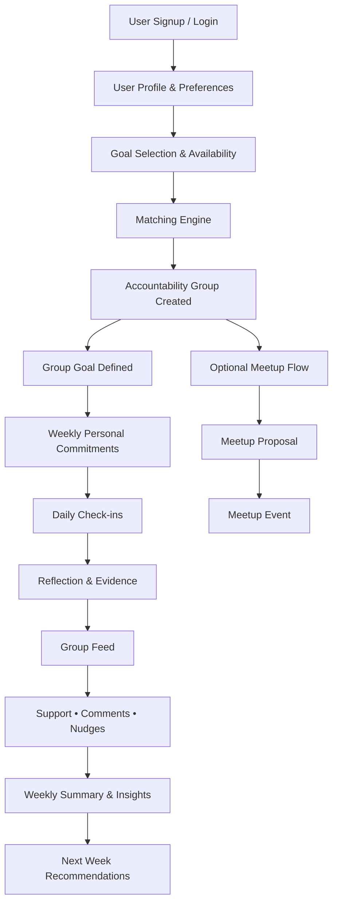

# Digital Wellness App (MVP Docs)

Digital Wellness App helps people stay consistent on personal goals through small accountability groups of 3-4 members. Users choose a focus area, get matched into a group, make weekly commitments, and post short daily check-ins with optional reflection or evidence. Daily streaks add urgency to the check-in habit, while group feedback, nudges, and weekly summaries create a lightweight loop that supports progress without high coordination cost.

## Core User Loop
1. User joins and sets profile, goal, and availability.
2. Matching engine places user into a small accountability group.
3. User sets weekly commitments and checks in daily.
4. Group members react, comment, and nudge each other.
5. Weekly summary generates insights and recommendations for next week.

## Workflow Diagram

## Scope
### MVP Scope
- Auth, profile, preferences, goal selection, availability.
- Group matching and group lifecycle for 3-4 members.
- Weekly commitments and daily check-ins.
- Reflection/evidence attachment (lightweight).
- Group feed with comments, reactions, nudges.
- Weekly summary, insights, and next-week recommendations.
- Optional meetup proposal and event scheduling.

### Later Scope
- Advanced matching quality scoring and rebalancing.
- Rich media evidence and content moderation tooling depth.
- Multi-group participation and cross-group discovery.
- Calendar integrations and advanced meetup logistics.
- Personalized coaching models and adaptive recommendation ranking.
