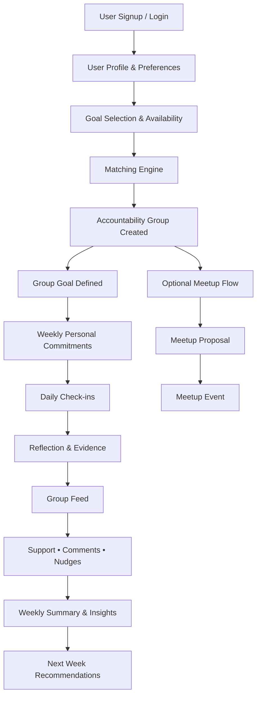

# 02 Workflow

## End-to-End Flow

## A. User Signup / Login
- User actions: Create account or authenticate returning session.
- Data created/updated: `User`, auth session metadata.
- Triggers: New user creation triggers profile onboarding flow.

## B. User Profile & Preferences
- User actions: Add display name, timezone, notification preferences, privacy defaults.
- Data created/updated: `Profile`, `Preferences`.
- Triggers: Profile completion unlocks goal selection.

## C. Goal Selection & Availability
- User actions: Select goal category and define availability windows.
- Data created/updated: `Goal`, `AvailabilityWindow`.
- Triggers: Completed goal + availability submits user to matching queue.

## D. Matching Engine
- User actions: Passive; user waits for match.
- Data created/updated: Matching candidates, match decision state.
- Triggers: When 3-4 compatible users exist, create group and memberships.

## E. Accountability Group Created
- User actions: Accept membership (or auto-join based on product choice).
- Data created/updated: `Group`, `GroupMember`.
- Triggers: Group creation opens group-goal setup and weekly cycle.

## F. Group Goal Defined
- User actions: Confirm a shared direction (for alignment, not identical tasks).
- Data created/updated: `GroupGoal`.
- Triggers: Enables weekly personal commitment setup.

## G. Weekly Personal Commitments
- User actions: Add 1-3 concrete commitments for the week.
- Data created/updated: `Commitment`.
- Triggers: Commitment creation starts check-in tracking for active week.

## H. Daily Check-ins
- User actions: Post daily status (done/partial/missed + optional note).
- Data created/updated: `CheckIn`, commitment progress counters.
- MVP behavior:
  - A valid daily check-in extends the user's streak by 1 day.
  - If a day is missed (by user timezone), streak resets to 0 on next check-in.
  - Streak status should be visible in the daily check-in confirmation state.
- Triggers: New check-in updates streak/progress and creates feed item.
- Related docs: [03_data_model.md](03_data_model.md), [04_api_contract.md](04_api_contract.md), [05_nonfunctional.md](05_nonfunctional.md).

## I. Reflection & Evidence
- User actions: Add short reflection and optional evidence reference.
- Data created/updated: `Reflection`, `Evidence`.
- Triggers: Reflection/evidence attachment enriches feed context and summaries.

## J. Group Feed
- User actions: View member activity timeline.
- Data created/updated: `GroupFeedItem` projection from check-ins/reflections/nudges.
- Triggers: New activity item notifies group members per preferences.

## K. Support • Comments • Nudges
- User actions: React, comment, or send nudge to a member.
- Data created/updated: `Comment`, `Reaction`, `Nudge`.
- Triggers: Interaction events update engagement signals and notification queue.

## L. Weekly Summary & Insights
- User actions: Review week-end report.
- Data created/updated: `WeeklySummary`, `Insight`.
- Triggers: End-of-week scheduler aggregates group + individual data.

## M. Next Week Recommendations
- User actions: Accept/adjust recommended commitments and cadence.
- Data created/updated: `Recommendation`, next-cycle draft commitments.
- Triggers: Recommendation acceptance seeds next weekly plan.

## N. Optional Meetup Flow
- User actions: Open meetup planning for group.
- Data created/updated: Meetup planning context linked to `Group`.
- Triggers: Initiates proposal creation flow.

## O. Meetup Proposal
- User actions: Propose format, time, and agenda; members respond.
- Data created/updated: `MeetupProposal`.
- Triggers: Proposal reaches threshold (or owner confirms) to create event.

## P. Meetup Event
- User actions: Confirm attendance, join event, mark completion.
- Data created/updated: `MeetupEvent`, attendance status.
- Triggers: Event completion can feed weekly insight generation.
